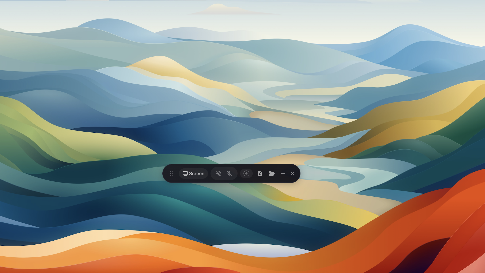
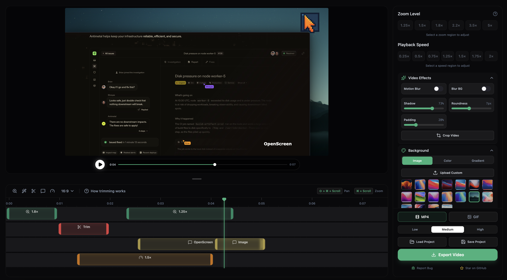

> [!WARNING]
> This is very much in beta and might be buggy here and there (but hope you have a good experience!).

<p align="center">
  
</p>

# <p align="center">OpenStudio</p>

<p align="center"><strong>OpenStudio is your free, open-source alternative to Screen Studio (sort of).</strong></p>

If you don't want to pay $29/month for Screen Studio but want a much simpler version that does what most people seem to need, making beautiful product demos and walkthroughs, here's a free-to-use app for you. OpenStudio does not offer all Screen Studio features, but covers the basics well!

Screen Studio is an awesome product and this is definitely not a 1:1 clone. OpenStudio is a much simpler take, just the basics for folks who want control and don't want to pay. If you need all the fancy features, your best bet is to support Screen Studio (they really do a great job, haha). But if you just want something free (no gotchas) and open, this project does the job!

OpenStudio is 100% free for personal and commercial use. Use it, modify it, distribute it. (Just be cool 😁 and give a shoutout if you feel like it !)

<p align="center">
  
  
</p>

## Core Features
- Record specific windows or your whole screen.
- Add automatic or manual zooms (adjustable depth levels) and customize their durarion and position.
- Record microphone and system audio.
- Crop video recordings to hide parts.
- Choose between wallpapers, solid colors, gradients or a custom background.
- Motion blur for smoother pan and zoom effects.
- Add annotations (text, arrows, images).
- Trim sections of the clip.
- Customize the speed of different segments.
- Export in different aspect ratios and resolutions.

## Installation

Download the latest installer for your platform from your project distribution channel.

### macOS

If you encounter issues with macOS Gatekeeper blocking the app (since it does not come with a developer certificate), you can bypass this by running the following command in your terminal after installation:

```bash
xattr -rd com.apple.quarantine /Applications/OpenStudio.app
```

Note: Give your terminal Full Disk Access in **System Settings > Privacy & Security** to grant you access and then run the above command.

After running this command, proceed to **System Preferences > Security & Privacy** to grant the necessary permissions for "screen recording" and "accessibility". Once permissions are granted, you can launch the app.

### Linux

Download the `.AppImage` file from the releases page. Make it executable and run:

```bash
chmod +x OpenStudio-Linux-*.AppImage
./OpenStudio-Linux-*.AppImage
```

You may need to grant screen recording permissions depending on your desktop environment.

**Note:** If the app fails to launch due to a "sandbox" error, run it with --no-sandbox:
```bash
./OpenStudio-Linux-*.AppImage --no-sandbox
```

### Limitations

System audio capture relies on Electron's [desktopCapturer](https://www.electronjs.org/docs/latest/api/desktop-capturer) and has some platform-specific quirks:

- **macOS**: Requires macOS 13+. On macOS 14.2+ you'll be prompted to grant audio capture permission. macOS 12 and below does not support system audio (mic still works).
- **Windows**: Works out of the box.
- **Linux**: Needs PipeWire (default on Ubuntu 22.04+, Fedora 34+). Older PulseAudio-only setups may not support system audio (mic should still work).

## Built with
- Electron
- React
- TypeScript
- Vite
- PixiJS
- dnd-timeline

---

_I'm new to open source, idk what I'm doing lol. If something is wrong please raise an issue 🙏_

## Contributing

Contributions are welcome. Use your preferred collaboration workflow (issue tracker, project board, or direct pull requests) to coordinate changes.

## License

This project is licensed under the [MIT License](./LICENSE). By using this software, you agree that the authors are not liable for any issues, damages, or claims arising from its use.
